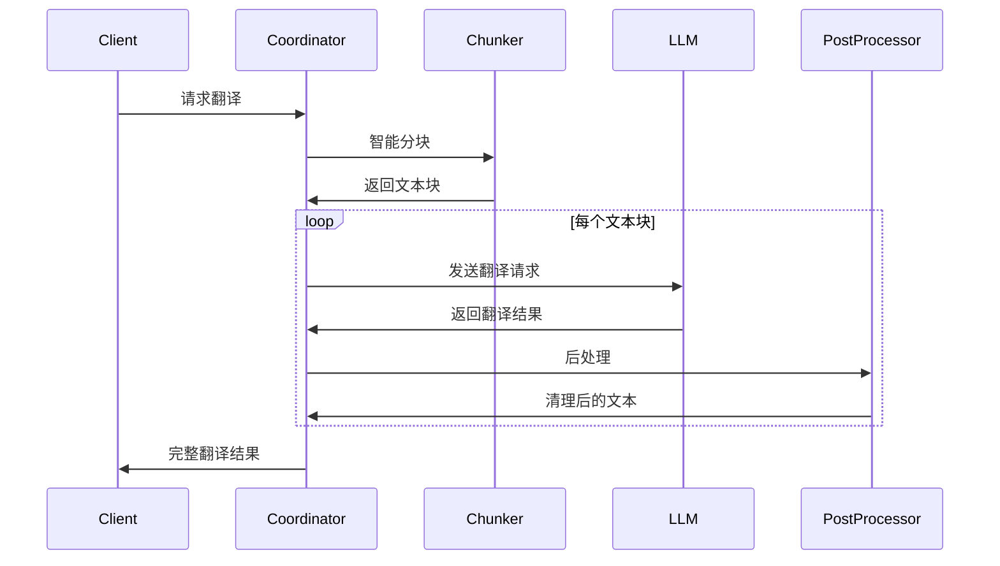
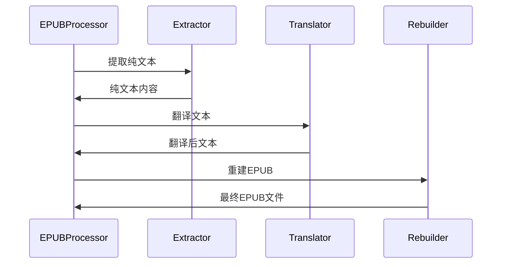

[根目录](../../CLAUDE.md) > [src](../) > **core**

# Core 模块 - 翻译引擎核心

## 模块职责

Core模块是TranslateBook with LLM的核心翻译引擎，负责与大语言模型(LLM)通信、处理不同格式的文件、优化翻译上下文以及生成高质量的翻译结果。

## 入口与启动

- **主入口**: `translator.py` - 翻译请求协调器
- **LLM客户端**: `llm_client.py` - LLM服务通信
- **提供商适配**: `llm_providers.py` - 多种LLM提供商支持

## 对外接口

### 核心翻译函数
```python
# 主要翻译函数 (translator.py)
async def translate_chunks(
    chunks: List[Dict],
    source_language: str,
    target_language: str,
    model: str,
    llm_client: LLMClient = None,
    log_callback: Callable = None
) -> List[str]
```

### 文件处理器接口
- `translate_file()` - 通用文件翻译
- `translate_epub()` - EPUB文件翻译
- `translate_srt()` - SRT字幕翻译
- `translate_text()` - 纯文本翻译

## 关键依赖与配置

### 内部依赖
- `prompts.prompts` - AI提示词模板
- `src.config` - 全局配置管理
- `src.utils` - 工具函数

### 外部依赖
- `httpx` - 异步HTTP客户端
- `lxml` - XML/HTML处理
- `tiktoken` - Token计算
- `aiofiles` - 异步文件操作

### 关键配置参数
```python
# 翻译配置
MAIN_LINES_PER_CHUNK = 25      # 每块行数
REQUEST_TIMEOUT = 900          # 请求超时(秒)
MAX_TRANSLATION_ATTEMPTS = 2   # 最大重试次数

# 上下文优化
OLLAMA_NUM_CTX = 8192          # Ollama上下文窗口
AUTO_ADJUST_CONTEXT = True     # 自动调整上下文
MIN_CHUNK_SIZE = 5             # 最小块大小
MAX_CHUNK_SIZE = 100           # 最大块大小
```

## 核心组件

### 1. 翻译协调器 (`translator.py`)
管理整个翻译流程：
- 分块策略实施
- 上下文传递
- 错误处理和重试
- 进度回调

### 2. LLM客户端 (`llm_client.py`)
统一的LLM通信接口：
```python
class LLMClient:
    async def make_request(
        self,
        prompt: str,
        model: str,
        system_prompt: Optional[str] = None
    ) -> str
```

### 3. 提供商适配器 (`llm_providers.py`)
支持多种LLM提供商：
- **OllamaProvider** - 本地Ollama服务
- **GeminiProvider** - Google Gemini API
- **OpenAIProvider** - OpenAI API

### 4. 上下文优化器 (`context_optimizer.py`)
智能优化翻译质量：
- Token使用估算
- 上下文窗口自动调整
- 分块大小优化

### 5. 文本处理器 (`text_processor.py`)
文本预处理和后处理：
- 智能分块
- 句子边界识别
- 格式清理

### 6. EPUB处理器 (`epub/`)
完整的EPUB处理链：
- `epub_fast_processor.py` - 快速EPUB处理
- `translator.py` - EPUB特定翻译
- `tag_preservation.py` - 标签保留
- `xml_helpers.py` - XML操作助手

### 7. 字幕处理器 (`srt_processor.py`, `subtitle_translator.py`)
SRT字幕专用处理：
- 时间轴保留
- 字幕块翻译
- 字符数限制处理

### 8. 后处理器 (`post_processor.py`)
翻译结果优化：
- 格式标准化
- 标签清理
- 质量检查

## 翻译流程

### 标准文本翻译流程


### EPUB翻译流程


## 数据模型

### 翻译块结构
```python
class TranslationChunk:
    main_content: str          # 主要翻译内容
    context_before: str        # 前文上下文
    context_after: str         # 后文上下文
    previous_translation: str  # 前一块翻译
    metadata: Dict            # 元数据信息
```

### LLM响应结构
```python
class LLMResponse:
    content: str              # 响应内容
    usage: Dict              # Token使用情况
    model: str               # 使用的模型
    response_time: float     # 响应时间
```

## 性能优化

### 上下文优化策略
1. **动态调整**: 根据模型上下文窗口自动调整块大小
2. **Token估算**: 使用tiktoken精确估算Token使用
3. **安全边界**: 保留20%的Token安全边界

### 并发处理
- 支持多个文件并行翻译
- 异步HTTP请求减少等待时间
- 连接池复用提高效率

### 缓存机制
- 翻译结果缓存（计划中）
- LLM响应缓存（计划中）
- 文件元数据缓存

## 测试与质量

### 当前状态
❌ **缺少自动化测试**

### 建议的测试覆盖
1. **单元测试**
   - 各提供商适配器测试
   - 分块算法测试
   - 上下文优化测试

2. **集成测试**
   - 端到端翻译流程测试
   - 不同文件格式支持测试
   - 错误恢复测试

3. **性能测试**
   - 大文件处理性能
   - 并发翻译性能
   - 内存使用优化测试

## 常见问题 (FAQ)

### Q: 如何选择合适的块大小？
A: 默认25行是平衡质量和效率的选择。更大的块保留更多上下文但增加Token消耗。

### Q: 翻译质量如何保证？
A: 通过：1)上下文传递保持一致性；2)系统提示词优化；3)后处理清理；4)多次重试机制。

### Q: 支持哪些LLM提供商？
A: 目前支持Ollama（本地）、Google Gemini、OpenAI。可通过实现`LLMProvider`基类添加新的提供商。

### Q: EPUB翻译会保留原始格式吗？
A: 是的，通过fast模式保留基本结构，或通过preservation模式保留完整格式。

## 相关文件清单

### 核心文件
- `__init__.py` - 模块初始化
- `translator.py` - 翻译协调器
- `llm_client.py` - LLM客户端
- `llm_providers.py` - 提供商适配器
- `context_optimizer.py` - 上下文优化器
- `post_processor.py` - 后处理器

### 处理器
- `text_processor.py` - 文本处理
- `srt_processor.py` - SRT处理
- `subtitle_translator.py` - 字幕翻译

### EPUB子模块
- `epub/__init__.py` - EPUB模块初始化
- `epub/epub_fast_processor.py` - 快速EPUB处理
- `epub/translator.py` - EPUB翻译器
- `epub/tag_preservation.py` - 标签保留
- `epub/xml_helpers.py` - XML助手
- `epub/job_collector.py` - 作业收集器
- `epub/constants.py` - 常量定义

## 变更记录 (Changelog)

**2025-12-05**: 创建Core模块文档，梳理翻译引擎架构和组件。