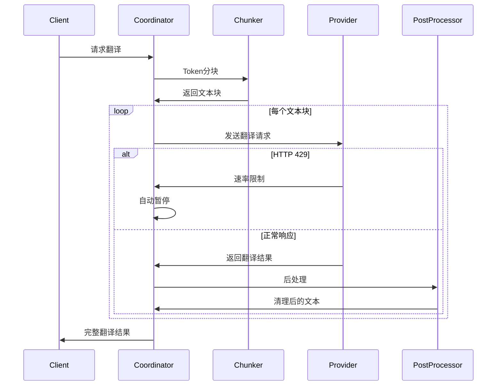
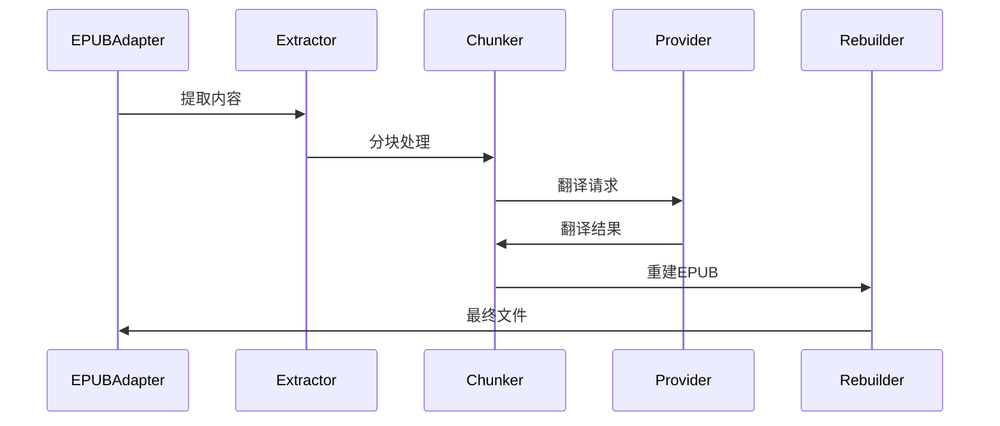

[根目录](../../CLAUDE.md) > [src](../) > **core**

# Core 模块 - 翻译引擎核心

## 变更记录

**2026-04-13 v2**:
- ✅ 更新以反映大规模架构重构
- ✅ 新增 LLM Provider 系统（llm/ 目录）
- ✅ 新增适配器系统（adapters/ 目录）
- ✅ 新增分块系统（chunking/ 目录）
- ✅ 新增 DOCX 支持（docx/ 目录）
- ✅ 新增思考行为检测（thinking/ 模块）
- ✅ 新增上下文检测工具（utils/ 模块）

**2025-12-05 v1**: 创建Core模块文档，梳理翻译引擎架构和组件。

---

## 模块职责

Core模块是TranslateBook with LLM的核心翻译引擎，负责与大语言模型(LLM)通信、处理不同格式的文件、优化翻译上下文以及生成高质量的翻译结果。

## 入口与启动

- **主入口**: `translator.py` - 翻译请求协调器
- **LLM客户端**: `llm_client.py` - LLM服务通信
- **提供商工厂**: `llm/factory.py` - LLM提供商实例化

## 目录结构

```
src/core/
├── __init__.py
├── translator.py              # 主翻译协调器
├── llm_client.py              # LLM客户端
├── post_processor.py          # 后处理器
├── progress_tracker.py        # 进度跟踪
├── text_processor.py          # 文本处理器
├── context_optimizer.py       # 上下文优化器
├── srt_processor.py           # SRT处理器
├── subtitle_translator.py     # 字幕翻译器
│
├── llm/                       # LLM Provider 系统
│   ├── __init__.py
│   ├── base.py                # 提供商基类
│   ├── factory.py             # 提供商工厂
│   ├── exceptions.py          # LLM异常
│   ├── providers/             # 提供商实现
│   │   ├── __init__.py
│   │   ├── ollama.py          # Ollama提供商
│   │   ├── openai.py          # OpenAI提供商
│   │   ├── gemini.py          # Gemini提供商
│   │   ├── deepseek.py        # DeepSeek提供商
│   │   ├── mistral.py         # Mistral提供商
│   │   ├── openrouter.py      # OpenRouter提供商
│   │   ├── poe.py             # POE提供商
│   │   └── nim.py             # NVIDIA NIM提供商
│   ├── thinking/              # 思考行为模块
│   │   ├── __init__.py
│   │   ├── detection.py       # 思考标签检测
│   │   ├── behavior.py        # 思考行为处理
│   │   └── cache.py           # 思考缓存
│   └── utils/                 # LLM工具模块
│       ├── __init__.py
│       ├── context_detection.py  # 上下文检测
│       └── extraction.py        # 内容提取
│
├── adapters/                  # 文件格式适配器
│   ├── __init__.py
│   ├── format_adapter.py      # 格式适配器基类
│   ├── epub_adapter.py        # EPUB适配器
│   ├── srt_adapter.py         # SRT适配器
│   ├── txt_adapter.py         # TXT适配器
│   ├── translate_file.py      # 通用文件翻译
│   ├── translation_unit.py    # 翻译单元
│   ├── retry_manager.py       # 重试管理器
│   ├── error_handler.py       # 错误处理器
│   ├── error_logger.py        # 错误日志记录器
│   ├── error_recovery.py      # 错误恢复机制
│   └── exceptions.py          # 适配器异常
│
├── chunking/                  # 分块系统
│   ├── __init__.py
│   └── token_chunker.py       # Token分块器
│
├── docx/                      # DOCX处理模块
│   └── (DOCX相关文件)
│
├── epub/                      # EPUB处理模块
│   ├── __init__.py
│   ├── epub_fast_processor.py # 快速EPUB处理
│   ├── translator.py          # EPUB翻译器
│   ├── tag_preservation.py    # 标签保留
│   ├── xml_helpers.py         # XML助手
│   └── (其他EPUB文件)
│
└── common/                    # 通用工具
    └── (通用工具文件)
```

## 对外接口

### 核心翻译函数
```python
# 主要翻译函数 (translator.py)
async def translate_chunks(
    chunks: List[Dict],
    source_language: str,
    target_language: str,
    model: str,
    llm_client: LLMClient = None,
    log_callback: Callable = None
) -> List[str]
```

### LLM Provider 接口
```python
# LLM Provider 基类 (llm/base.py)
class BaseLLMProvider(ABC):
    @abstractmethod
    async def translate(
        self,
        text: str,
        source_lang: str,
        target_lang: str,
        **kwargs
    ) -> str:
        pass

    @abstractmethod
    async def supports_streaming(self) -> bool:
        pass
```

### 文件处理器接口
- `translate_file()` - 通用文件翻译
- `translate_epub()` - EPUB文件翻译
- `translate_srt()` - SRT字幕翻译
- `translate_text()` - 纯文本翻译
- `translate_docx()` - DOCX文档翻译（新）

## 关键依赖与配置

### 内部依赖
- `prompts.prompts` - AI提示词模板
- `src.config` - 全局配置管理
- `src.utils` - 工具函数

### 外部依赖
- `httpx` - 异步HTTP客户端
- `lxml` - XML/HTML处理
- `tiktoken` - Token计算
- `aiofiles` - 异步文件操作
- `python-docx` - DOCX处理（新）

### 关键配置参数
```python
# 翻译配置
MAIN_CHUNK_SIZE = 1000         # 每块字符数
MAX_TOKENS_PER_CHUNK = 400     # 每块最大Token数
SOFT_LIMIT_RATIO = 0.8         # 软限制比例
REQUEST_TIMEOUT = 900          # 请求超时(秒)
MAX_TRANSLATION_ATTEMPTS = 3   # 最大重试次数

# 上下文优化
OLLAMA_NUM_CTX = 4096          # Ollama上下文窗口
AUTO_ADJUST_CONTEXT = True     # 自动调整上下文

# 文件格式配置
SRT_LINES_PER_BLOCK = 20       # SRT每块行数
SRT_MAX_CHARS_PER_BLOCK = 2000 # SRT每块字符数
```

## 核心组件

### 1. LLM Provider 系统 (`llm/`)

#### 提供商工厂 (`factory.py`)
```python
class LLMProviderFactory:
    """LLM提供商工厂类"""

    PROVIDER_REGISTRY = {
        'ollama': OllamaProvider,
        'openai': OpenAIProvider,
        'gemini': GeminiProvider,
        'deepseek': DeepSeekProvider,
        'mistral': MistralProvider,
        'openrouter': OpenRouterProvider,
        'poe': PoeProvider,
        'nim': NIMProvider,
    }

    @classmethod
    def create_provider(cls, provider_type: str, **kwargs) -> BaseLLMProvider:
        """创建提供商实例"""
```

#### 支持的提供商

| 提供商 | 文件 | 模型示例 | 特点 |
|--------|------|----------|------|
| Ollama | `ollama.py` | qwen3:14b | 本地免费 |
| OpenAI | `openai.py` | gpt-4o | 官方API |
| Gemini | `gemini.py` | gemini-2.0-flash | Google最新 |
| DeepSeek | `deepseek.py` | deepseek-chat | 中文优化 |
| Mistral | `mistral.py` | mistral-large-latest | 128K上下文 |
| OpenRouter | `openrouter.py` | 200+ 模型 | 模型市场 |
| POE | `poe.py` | Claude-Sonnet-4 | 多平台聚合 |
| NIM | `nim.py` | llama-3.1-8b | NVIDIA云端 |

#### 思考行为模块 (`thinking/`)
```python
# 思考标签检测
def extract_thinking_content(response: str) -> tuple[str, str]:
    """提取思考内容和实际翻译"""

def detect_thinking_tags(text: str) -> bool:
    """检测是否包含思考标签"""

# 思考缓存
class ThinkingCache:
    """缓存模型的思考过程用于调试"""
```

### 2. 适配器系统 (`adapters/`)

#### 格式适配器 (`format_adapter.py`)
```python
class FormatAdapter(ABC):
    """文件格式适配器基类"""

    @abstractmethod
    async def extract_content(self, file_path: str) -> List[TranslationUnit]:
        """提取可翻译内容"""

    @abstractmethod
    async def rebuild_file(
        self,
        units: List[TranslationUnit],
        output_path: str
    ) -> str:
        """重建翻译后的文件"""
```

#### 支持的适配器
- `EPUBAdapter` - EPUB电子书
- `SRTAdapter` - SRT字幕
- `TXTAdapter` - 纯文本
- `DOCXAdapter` - Word文档（新）

#### 错误处理系统
- `ErrorHandler` - 统一错误处理
- `ErrorLogger` - 错误日志记录
- `ErrorRecovery` - 错误恢复机制
- `RetryManager` - 智能重试管理

### 3. 分块系统 (`chunking/`)

#### Token 分块器 (`token_chunker.py`)
```python
class TokenChunker:
    """基于Token的智能分块器"""

    def __init__(
        self,
        max_tokens: int = 400,
        soft_limit_ratio: float = 0.8,
        encoding: str = "cl100k_base"
    ):
        self.max_tokens = max_tokens
        self.soft_limit = int(max_tokens * soft_limit_ratio)
        self.encoding = tiktoken.get_encoding(encoding)

    def chunk_text(self, text: str) -> List[str]:
        """将文本分割为适合LLM处理的块"""
```

### 4. 翻译协调器 (`translator.py`)
管理整个翻译流程：
- 分块策略实施
- 上下文传递
- 错误处理和重试
- 进度回调
- HTTP 429 自动暂停

### 5. 上下文优化器 (`context_optimizer.py`)
智能优化翻译质量：
- Token使用估算
- 上下文窗口自动调整
- 分块大小优化
- 自适应上下文重试

### 6. 进度跟踪器 (`progress_tracker.py`)
实时翻译进度跟踪：
- WebSocket 推送
- 百分比计算
- ETA 估算
- 错误统计

## 翻译流程

### 标准文本翻译流程

```mermaid
sequenceDiagram
    participant Client
    participant Coordinator
    participant Chunker
    participant Provider
    participant PostProcessor

    Client->>Coordinator: 请求翻译
    Coordinator->>Chunker: Token分块
    Chunker->>Coordinator: 返回文本块
    loop 每个文本块
        Coordinator->>Provider: 发送翻译请求
        alt HTTP 429
            Provider->>Coordinator: 速率限制
            Coordinator->>Coordinator: 自动暂停
        else 正常响应
            Provider->>Coordinator: 返回翻译结果
            Coordinator->>PostProcessor: 后处理
            PostProcessor->>Coordinator: 清理后的文本
        end
    end
    Coordinator->>Client: 完整翻译结果
```

### EPUB翻译流程

```mermaid
sequenceDiagram
    participant EPUBAdapter
    participant Extractor
    participant Chunker
    participant Provider
    participant Rebuilder

    EPUBAdapter->>Extractor: 提取内容
    Extractor->>Chunker: 分块处理
    Chunker->>Provider: 翻译请求
    Provider->>Chunker: 翻译结果
    Chunker->>Rebuilder: 重建EPUB
    Rebuilder->>EPUBAdapter: 最终文件
```

## 数据模型

### 翻译单元结构
```python
@dataclass
class TranslationUnit:
    """翻译单元"""
    id: str                    # 唯一标识
    content: str               # 原始内容
    context_before: str        # 前文上下文
    context_after: str         # 后文上下文
    metadata: Dict             # 元数据
    translation: Optional[str] = None  # 翻译结果
```

### LLM响应结构
```python
@dataclass
class LLMResponse:
    """LLM响应"""
    content: str              # 响应内容
    thinking: Optional[str]   # 思考内容
    usage: Dict              # Token使用情况
    model: str               # 使用的模型
    response_time: float     # 响应时间
    provider: str            # 提供商名称
```

## 性能优化

### 上下文优化策略
1. **动态调整**: 根据模型上下文窗口自动调整块大小
2. **Token估算**: 使用tiktoken精确估算Token使用
3. **安全边界**: 保留20%的Token安全边界
4. **自适应重试**: 上下文过大时自动减小块大小重试

### 并发处理
- 支持多个文件并行翻译
- 异步HTTP请求减少等待时间
- 连接池复用提高效率

### 错误恢复
- HTTP 429 自动暂停和恢复
- 指数退避重试策略
- 上下文自适应降级
- 详细错误日志记录

## 测试与质量

### 建议的测试覆盖
1. **单元测试**
   - 各提供商适配器测试
   - 分块算法测试
   - 上下文优化测试
   - 思考行为检测测试

2. **集成测试**
   - 端到端翻译流程测试
   - 不同文件格式支持测试
   - 错误恢复测试
   - 多提供商切换测试

3. **性能测试**
   - 大文件处理性能
   - 并发翻译性能
   - 内存使用优化测试
   - 使用 `benchmark/` 框架

## 常见问题 (FAQ)

### Q: 如何选择合适的提供商？
A: 根据需求选择：
- **隐私优先**: Ollama（本地）
- **质量优先**: OpenAI GPT-4o
- **成本优先**: DeepSeek
- **中文优化**: DeepSeek, Gemini
- **模型多样性**: OpenRouter

### Q: Token 分块和行分块有什么区别？
A: Token 分块更精确，使用 tiktoken 计算 Token 数量，确保不超过模型上下文窗口；行分块简单但不够精确。

### Q: 如何处理 HTTP 429 错误？
A: 系统会自动检测 429 错误并暂停翻译，等待适当时间后自动恢复。可在 `.env` 中配置 `MAX_TRANSLATION_ATTEMPTS`。

### Q: 什么是思考行为检测？
A: 某些模型（如 Claude）会输出 `<thinking>` 标签包含推理过程。系统会自动提取这些内容用于调试，只返回实际翻译结果。

## 相关文件清单

### 核心文件
- `__init__.py` - 模块初始化
- `translator.py` - 翻译协调器
- `llm_client.py` - LLM客户端
- `post_processor.py` - 后处理器
- `progress_tracker.py` - 进度跟踪器
- `context_optimizer.py` - 上下文优化器

### LLM Provider 系统
- `llm/base.py` - 提供商基类
- `llm/factory.py` - 提供商工厂
- `llm/exceptions.py` - LLM异常
- `llm/providers/*.py` - 提供商实现
- `llm/thinking/*.py` - 思考行为模块
- `llm/utils/*.py` - LLM工具模块

### 适配器系统
- `adapters/format_adapter.py` - 格式适配器基类
- `adapters/epub_adapter.py` - EPUB适配器
- `adapters/srt_adapter.py` - SRT适配器
- `adapters/txt_adapter.py` - TXT适配器
- `adapters/translate_file.py` - 通用文件翻译
- `adapters/retry_manager.py` - 重试管理器
- `adapters/error_*.py` - 错误处理模块

### 分块系统
- `chunking/token_chunker.py` - Token分块器

### 文档处理
- `docx/*` - DOCX处理模块
- `epub/*` - EPUB处理模块

---

**最后更新**: 2026-04-13
**版本**: 2.0
