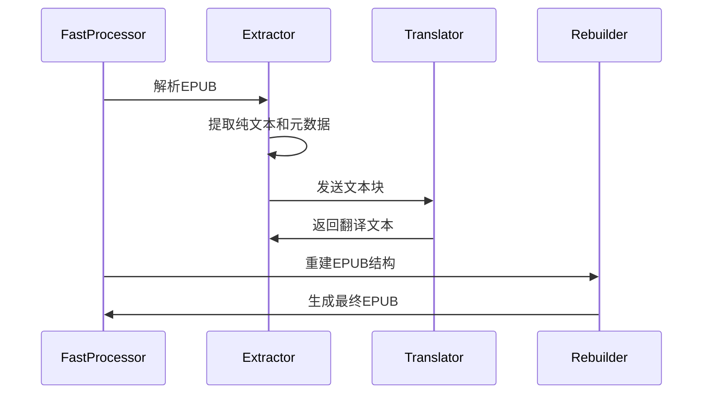

[根目录](../../../CLAUDE.md) > [src](../../) > [core](../) > **epub**

# EPUB处理模块 - 电子书翻译专用

## 模块职责

EPUB处理模块专门负责电子书文件的解析、翻译和重建，支持两种处理模式：快速模式（纯文本提取翻译）和保持模式（保留完整格式）。

## 入口与启动

- **快速处理入口**: `epub_fast_processor.py` - 生产就绪的EPUB处理
- **格式保持入口**: `translator.py` - 完整格式保留处理
- **标签处理**: `tag_preservation.py` - HTML/XML标签管理

## 对外接口

### 主要处理函数

#### 快速模式接口
```python
async def extract_pure_text_from_epub(epub_path: str, log_callback=None) -> tuple[str, dict]
async def rebuild_epub_from_translated_text(translated_text: str, metadata: dict, output_path: str, log_callback=None)
```

#### 格式保持模式接口
```python
async def translate_epub_file(input_path: str, output_path: str, source_lang: str, target_lang: str,
                             model: str, preserve_formatting=True, log_callback=None)
```

## 关键依赖与配置

### 内部依赖
- `../text_processor` - 文本分块处理
- `../translator` - 核心翻译引擎
- `src.config` - 配置参数

### 外部依赖
- `lxml` - XML/HTML解析和处理
- `zipfile` - EPUB文件操作
- `aiofiles` - 异步文件IO

### EPUB规范遵循
- **标准版本**: EPUB 2.0 (最大兼容性)
- **编码**: UTF-8
- **压缩**: ZIP格式，特定文件顺序
- **命名空间**: 支持标准EPUB命名空间

## 核心组件

### 1. 快速处理器 (`epub_fast_processor.py`)

**生产就绪的EPUB处理方案**：
- 提取100%纯文本，剥离所有标记
- 等大小分块，尊重句子边界
- 标准文本翻译流程
- 重建符合EPUB 2.0标准的文件

**特点**：
- 扁平目录结构（无OEBPS文件夹）
- 正确的ZIP文件顺序
- 兼容最严格的阅读器
- 处理任何复杂的EPUB输入

### 2. 格式保持翻译器 (`translator.py`)

保持原始格式的EPUB翻译：
- 保留HTML标签结构
- 处理内联样式
- 维持章节划分
- 保留图片引用

### 3. 标签保留器 (`tag_preservation.py`)

智能标签处理：
- 识别翻译内容区域
- 保护HTML/XML标签
- 处理嵌套结构
- 属性保留策略

### 4. XML助手 (`xml_helpers.py`)

XML操作工具集：
- 命名空间处理
- XPath查询简化
- 元数据提取
- 内容清理

### 5. 作业收集器 (`job_collector.py`)

EPUB内容分析：
- 章节识别
- 文本内容提取
- 资源文件清单
- 结构分析

### 6. 常量定义 (`constants.py`)

EPUB处理常量：
```python
NAMESPACES = {
    'opf': 'http://www.idpf.org/2007/opf',
    'dc': 'http://purl.org/dc/elements/1.1/',
    'xhtml': 'http://www.w3.org/1999/xhtml'
}
```

## 处理流程

### 快速模式流程


### EPUB文件结构
```
EPUB文件 (ZIP)
├── mimetype (必须第一个，无压缩)
├── META-INF/
│   └── container.xml
├── content.opf (包文档)
├── toc.ncx (可选目录)
└── chapters/
    ├── chapter1.xhtml
    ├── chapter2.xhtml
    └── ...
```

## 数据模型

### EPUB元数据结构
```python
@dataclass
class EPUBMetadata:
    title: str = 'Untitled'
    author: str = 'Unknown'
    language: str = 'en'
    identifier: str = ''
    publisher: str = ''
    description: str = ''
    pub_date: str = ''
    modified_date: str = ''
```

### 章节信息结构
```python
@dataclass
class ChapterInfo:
    id: str
    href: str
    title: str
    content: str
    order: int
```

## 性能优化

### 内存管理
- 流式处理大文件
- 临时文件自动清理
- 增量处理避免全量加载

### 处理速度
- 并行章节处理
- 异步IO操作
- 智能跳过非文本内容

### 质量保证
- 字符编码自动检测
- 损坏文件恢复
- 结构验证

## 测试与质量

### 当前状态
❌ **缺少自动化测试**

### 建议的测试覆盖
1. **单元测试**
   - 元数据提取测试
   - 章节解析测试
   - 标签保留测试

2. **集成测试**
   - 完整翻译流程测试
   - 不同EPUB版本兼容性
   - 损坏文件处理测试

3. **质量测试**
   - 输出EPUB验证
   - 阅读器兼容性测试
   - 翻译质量检查

### 测试文件建议
- 简单文本EPUB
- 复杂格式EPUB
- 多语言内容EPUB
- 损坏/不完整EPUB

## 常见问题 (FAQ)

### Q: 快速模式和格式保持模式如何选择？
A: 快速模式兼容性最好，适合所有阅读器。格式保持模式保留原始样式但可能不兼容所有阅读器。

### Q: 如何处理EPUB中的图片？
A: 图片会被保留但不会被翻译。快速模式简化图片引用，保持模式完整保留。

### Q: 支持EPUB 3.0吗？
A: 输入支持任何版本，但输出始终是EPUB 2.0以确保最大兼容性。

### Q: 翻译后章节顺序会改变吗？
A: 不会，完全保持原始章节顺序和结构。

## 相关文件清单

- `__init__.py` - 模块导出
- `epub_fast_processor.py` - 快速处理器（推荐）
- `translator.py` - 格式保持翻译器
- `tag_preservation.py` - 标签处理
- `xml_helpers.py` - XML工具
- `job_collector.py` - 内容分析
- `constants.py` - 常量定义

## 变更记录 (Changelog)

**2025-12-05**: 创建EPUB模块文档，梳理电子书处理架构。